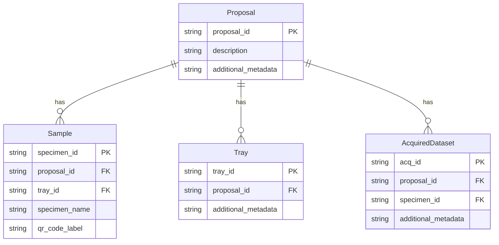
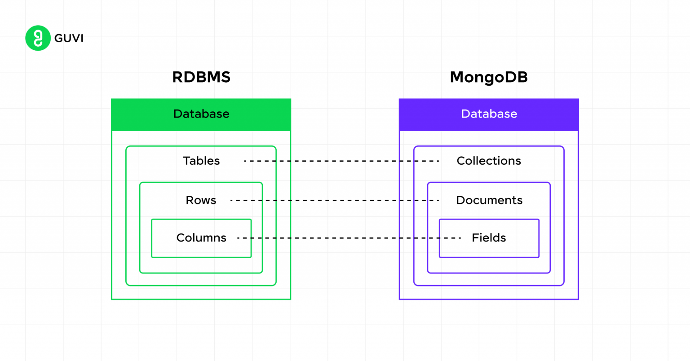
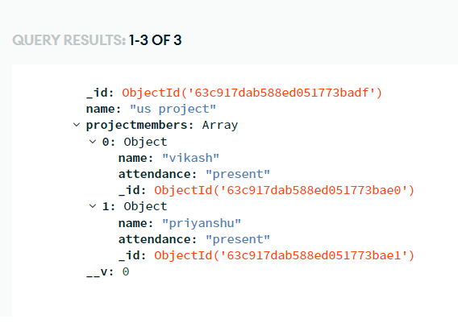

# Concepts

## High-level Requirement

- Register a proposal before beam time along with details of the samples and trays for QR Code
  Management.
- During beamtime dataset is acquired for samples and associated with the proposal.



## MongoDB Data Model

<div>
  
  
</div>

## [SciCat](https://www.scicatproject.org/#) - Scientific Metadata Catalog

DESY SciCat: https://public-data.desy.de/

### Some Predefined SciCat Models

#### Proposal

```
{
  "ownerGroup": "string",
  "accessGroups": [
    "string"
  ],
  "instrumentGroup": "string",
  "proposalId": "string",
  "pi_email": "user@example.com",
  "pi_firstname": "string",
  "pi_lastname": "string",
  "email": "user@example.com",
  "firstname": "string",
  "lastname": "string",
  "title": "string",
  "abstract": "string",
  "startTime": "2025-11-02T19:48:08.682Z",
  "endTime": "2025-11-02T19:48:08.682Z",
  "MeasurementPeriodList": [
    {
      "_id": "string",
      "instrument": "string",
      "start": "2025-11-02T19:48:08.682Z",
      "end": "2025-11-02T19:48:08.682Z",
      "comment": "string"
    }
  ],
  "metadata": {},
  "parentProposalId": "string",
  "type": "string",
  "instrumentIds": [
    "string"
  ]
}
```

#### Dataset

```
{
  "ownerGroup": "string",
  "accessGroups": [
    "string"
  ],
  "instrumentGroup": "string",
  "owner": "string",
  "ownerEmail": "user@example.com",
  "orcidOfOwner": "string",
  "contactEmail": "user@example.com",
  "sourceFolder": "string",
  "sourceFolderHost": "string",
  "size": 0,
  "packedSize": 0,
  "numberOfFiles": 0,
  "numberOfFilesArchived": 0,
  "creationTime": "2025-11-03T15:25:22.632Z",
  "validationStatus": "string",
  "keywords": [
    "string"
  ],
  "description": "string",
  "datasetName": "string",
  "classification": "string",
  "license": "string",
  "isPublished": false,
  "techniques": [],
  "sharedWith": [],
  "relationships": [],
  "datasetlifecycle": {},
  "scientificMetadata": {},
  "comment": "string",
  "dataQualityMetrics": 0,
  "proposalId": "string",
  "runNumber": "string",
  "principalInvestigator": "string",
  "startTime": "2025-11-03T15:25:22.632Z",
  "endTime": "2025-11-03T15:25:22.632Z",
  "creationLocation": "string",
  "dataFormat": "string",
  "sampleId": "string",
  "instrumentId": "string",
  "pid": "string",
  "version": "string",
  "type": "raw",
  "investigator": "string",
  "inputDatasets": [
    "string"
  ],
  "usedSoftware": [
    "string"
  ],
  "jobParameters": {},
  "jobLogData": "string"
}
```

#### Instrument

```
{
  "pid": "string",
  "uniqueName": "string",
  "name": "string",
  "customMetadata": {}
}
```

## Concert Integration

From

```python
class Experiment:

    async def __ainit__(self, walker, ...) -> None:
        ...

    async def _run(self) -> None:
        ...
        handler: RemoteLoggingHandler = await self.walker.register_logger(...)
        self.log.addHandler(handler)
        ...
        await self.walker.log_to_json(...)
        ...
        await handler.close()
        self.log.removeHandler(handler)
```

To

```
Develop an interface to register approved beam time proposal to a database.
```

```python
class MetadataHandler(...):
    """
    Umbrella implementation for logging and metadata handling.

    - Can write metadata to files.
    - Can write metadata to remote backend.
      - Needs (endpoint + credentials).
    """
    ...

class Experiment:

    async def __ainit__(self, walker, handler: MetadataHandler, ...) -> None:
        ...

    async def _run(self) -> None:
        ...
        self.handler.handle(...)
        ...
```

- Direct - Remote Backend REST Endpoint
- Python Clients
  - [scitacean](https://www.scicatproject.org/scitacean/index.html)
  - [pyscicat](https://www.scicatproject.org/pyscicat/)

## Deployment

- Deployment
  - Native
  - Container Orchestration
    - Compose
    - K8s
- Authentication & Security
  - **OIDC**: https://www.scc.kit.edu/en/services/openid-connect.php
  - **LDAP**: https://www.scc.kit.edu/en/services/faq-kit-ad.php
- Storage / Database Management (Can be in **LSDF**)
  - Raw File System
  - K8s StorageClass (NFS, Managed Raw File System)
